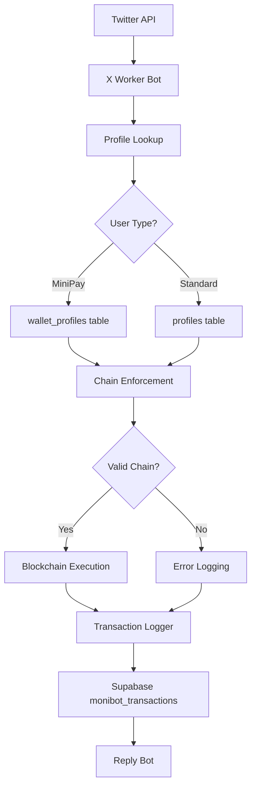

# Technical Documentation: X Worker Bot - MiniPay Support

## 1. Feature Overview

### What is MiniPay?
MiniPay is a mobile wallet app that operates exclusively on the Celo network, integrated seamlessly with MoniPay. It is designed for mobile-first users, particularly in emerging markets such as Nigeria and the Philippines, offering a low-friction entry point into the MoniPay ecosystem.

**Key Characteristics:**
- **Single-chain:** Supports Celo only.
- **Mobile-first:** Optimized for use within the MiniPay mobile application.
- **Separate User Database:** MiniPay users are stored in the `wallet_profiles` table, distinct from standard multi-chain users.

### What Problem Does This Feature Solve?
Before this upgrade, MiniPay users were unable to use the X Worker Bot because their profiles were not being searched. Additionally:
- Standard users could accidentally attempt to send funds to MiniPay recipients on unsupported chains (e.g., Base).
- There was no way to track user types for specialized analytics or AI-generated replies.
- The system lacked a mechanism to enforce network defaults specifically for mobile-first MiniPay wallets.

### User Types

| User Type | Database Table | Chains Supported | Wallet Type |
|-----------|----------------|------------------|-------------|
| **MiniPay Users** | `wallet_profiles` | Celo only | Mobile (MiniPay app) |
| **Standard Users** | `profiles` | Multi-chain (Base, BSC, Celo, Ink, Tempo, Solana) | Web + Mobile |

---

## 2. System Architecture

### High-Level Architecture
The X Worker Bot acts as the execution engine that connects Twitter commands to the blockchain and logs results for the Reply Bot.



### Key Components
1.  **Database Layer (`database.js`):** Handles profile normalization and unified lookups across multiple tables.
2.  **MiniPay Utility (`minipay.js`):** Centralized logic for chain enforcement and MagicPay claim modes.
3.  **Command Processing Layer (`twitter.js`):** Detects networks, overrides chains for MiniPay senders, and applies enforcement logic.
4.  **Multi-Recipient Handler (`multiRecipient.js`):** Processes batch payments while respecting individual recipient restrictions.
5.  **Scheduler (`scheduler.js`):** Manages scheduled payments with full MiniPay awareness.

### Database Schema
The `monibot_transactions` table includes new metadata columns:
-   `sender_source` (TEXT, nullable): Values are `'profiles'` or `'wallet_profiles'`.
-   `magicpay_claim_mode` (TEXT, nullable): Values are `'mandatory'` (for MiniPay on Celo) or `'default'`.

---

## 3. Implementation Details - Database Layer (`database.js`)

### Function: `normalizeProfile(row, source)`
**Purpose:** Converts raw database records from either table into a unified Profile object.

**Signature:** `function normalizeProfile(row, source)`

**Returns:**
```javascript
{
  id: String,
  source: 'profile' | 'wallet_profile',
  pay_tag: String,
  wallet_address: String,
  solana_address: String | null,
  preferred_network: String,
  addresses: {
    base: String | null,
    bsc: String | null,
    celo: String, // Always populated
    ink: String | null,
    tempo: String | null,
    solana: String | null
  }
  // ... other standard fields
}
```

### Function: `getProfileByXUsername(xUsername)`
**Purpose:** Searches for a user by Twitter handle across `profiles` (priority) and `wallet_profiles` (fallback).

**Algorithm:**
1.  Clean username and convert to lowercase.
2.  Query `profiles` table where `x_verified = true`.
3.  If not found, query `wallet_profiles` table.
4.  Return a normalized profile object or `null`.

### Function: `logTransaction(params)`
**Purpose:** Records the transaction with MiniPay-specific metadata.

**Mapping Logic:**
-   `sender_source: 'wallet_profile'` → Logs as `'wallet_profiles'`.
-   `sender_source: 'profile'` → Logs as `'profiles'`.

---

## 4. Implementation Details - MiniPay Utilities (`minipay.js`)

### Function: `enforceMiniPayChainRestriction(senderProfile, recipientProfile, chain)`
**Purpose:** Validates that MiniPay users only participate in Celo transactions.

**Validation Rules:**
1.  **Sender:** If sender is a `wallet_profile`, `chain` must be `'celo'`.
2.  **Recipient:** If recipient is a `wallet_profile`, `chain` must be `'celo'`.
3.  **Error Codes:** `ERROR_MINIPAY_SENDER_CHAIN_RESTRICTION` or `ERROR_MINIPAY_RECIPIENT_CHAIN_RESTRICTION`.

### Function: `determineMagicPayClaimMode(senderProfile, chain)`
**Purpose:** Sets the claim mode for MagicPay (escrow) transactions.

**Logic:** Returns `'mandatory'` if the sender is a MiniPay user on Celo, otherwise returns `'default'`.

---

## 5. Implementation Details - Network Detection (`twitter.js`)

### `NETWORK_KEYWORDS` Configuration
The keyword detection logic has been updated to prioritize Celo when MiniPay-specific terms are used.

```javascript
const NETWORK_KEYWORDS = {
  celo: ['on celo', 'celo', 'minipay'],
  // ... other chains
};
```

---

## 6. Main Command Processing (`twitter.js`)

### `processP2PCommand` Algorithm
1.  **Unified Lookup:** Fetch the author's profile using `getProfileByXUsername`.
2.  **Network Detection:** Identify the requested chain from the tweet text.
3.  **MiniPay Override:** If the sender is a MiniPay user, force the `startingChain` to `'celo'`.
4.  **Sender Enforcement:** Call `enforceMiniPayChainRestriction`. If invalid, log the error and abort.
5.  **Identity Resolution:** Check if the recipient exists.
6.  **Recipient Enforcement:** If the recipient is a MiniPay user, ensure the chain is `'celo'`.
7.  **Execution:** Execute `executeP2PViaRouter` or `executeMagicPay` (with claim mode).
8.  **Logging:** Log the result with `sender_source` and `magicpay_claim_mode`.

---

## 7. User Experience Flows

### Scenario: MiniPay User Success
**Tweet:** "@monibot send $1 to @alice"
**Flow:** Bot detects sender is MiniPay, overrides chain to Celo, validates sender/recipient, executes on Celo, and logs `sender_source: 'wallet_profiles'`.
**Result:** Success.

### Scenario: Chain Restriction (Standard to MiniPay)
**Tweet:** "@monibot send $5 to @bob_minipay on base"
**Flow:** Bot detects @bob_minipay is a MiniPay user. Since the chain is Base, it triggers `ERROR_MINIPAY_RECIPIENT_CHAIN_RESTRICTION`.
**Result:** Aborted with a reply explaining that the recipient only receives on Celo.

---

## 8. Error Handling

### Error Code Reference

| Error Code | Meaning | Recovery Path |
|-----------|---------|---------------|
| `ERROR_MINIPAY_SENDER_CHAIN_RESTRICTION` | MiniPay sender tried non-Celo chain. | User should retry with "on celo". |
| `ERROR_MINIPAY_RECIPIENT_CHAIN_RESTRICTION` | Recipient is MiniPay but chain is not Celo. | User should retry with "on celo". |

---

## 9. Multi-Recipient Support (`multiRecipient.js`)

The `executeMultiRecipientP2P` function now iterates through recipients and applies MiniPay restrictions individually. If one recipient violates a restriction (e.g., MiniPay user on Base), that specific payment is logged as a failure and skipped, while the rest of the batch continues.

---

## 10. Scheduler Support (`scheduler.js`)

Scheduled payments now correctly resolve recipients across both tables and log the `sender_source`. MiniPay senders are restricted to Celo at the time of schedule execution.

---

## 11. Database Migration

### File: `migrations/add_minipay_columns.sql`
Adds the necessary columns to `monibot_transactions` for tracking and relaxes foreign key constraints.

```sql
ALTER TABLE monibot_transactions ADD COLUMN IF NOT EXISTS sender_source TEXT;
ALTER TABLE monibot_transactions ADD COLUMN IF NOT EXISTS magicpay_claim_mode TEXT;
CREATE INDEX IF NOT EXISTS idx_monibot_transactions_sender_source ON monibot_transactions(sender_source);

-- Relax foreign key constraints to allow IDs from both profiles and wallet_profiles tables
ALTER TABLE monibot_transactions DROP CONSTRAINT IF EXISTS monibot_transactions_sender_id_fkey;
ALTER TABLE monibot_transactions DROP CONSTRAINT IF EXISTS monibot_transactions_receiver_id_fkey;
```

---

## 12. Testing & Verification

### Manual Verification Steps
1.  **Lookup Check:** Use a MiniPay handle and ensure the log shows `Source: wallet_profile`.
2.  **Restriction Check:** Attempt a payment from a MiniPay account without specifying Celo; verify it defaults to Celo or errors if another chain was forced.
3.  **MagicPay Check:** Send to an unregistered user from MiniPay and verify `magicpay_claim_mode` is `mandatory`.

---

## 13. Deployment Checklist
- [ ] Run `migrations/add_minipay_columns.sql` on the production Supabase instance.
- [ ] Deploy the updated Worker Bot code.
- [ ] Monitor the `monibot_transactions` table for the `sender_source` column being populated.
- [ ] Verify that the X Reply Bot is correctly interpreting the new error reasons.

---

## 14. Analytics & Monitoring

### Key Queries
**MiniPay vs Standard Volume:**
```sql
SELECT sender_source, COUNT(*), SUM(amount)
FROM monibot_transactions
GROUP BY sender_source;
```

**Common MiniPay Errors:**
```sql
SELECT tx_hash, COUNT(*)
FROM monibot_transactions
WHERE tx_hash LIKE 'ERROR_MINIPAY_%'
GROUP BY tx_hash;
```
