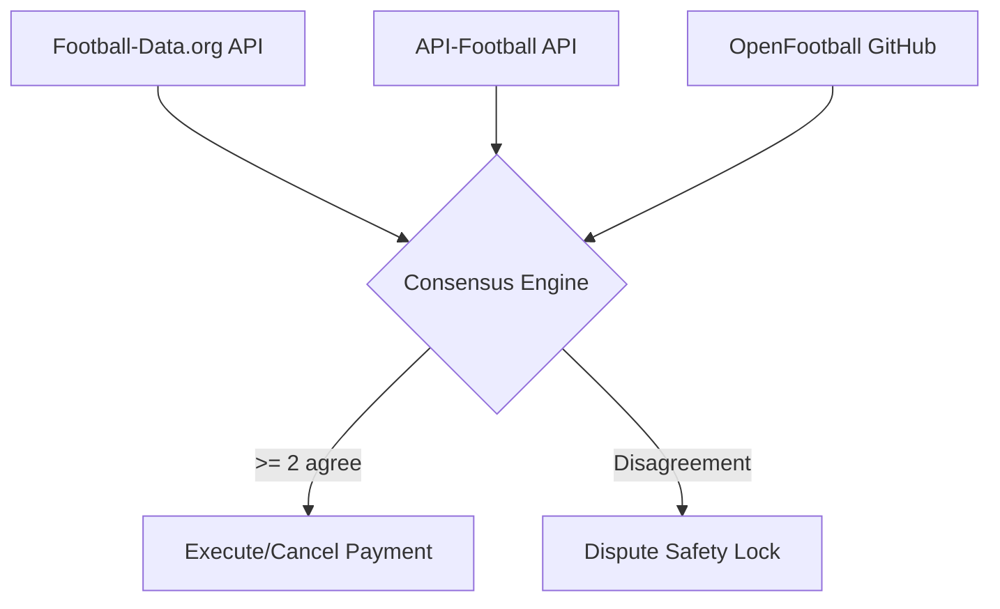

# World Cup Sports Oracle

For a feature that moves money based on results, no single free source is good enough. You want a primary + fallback + sanity check, and only settle when ≥2 agree. This is why we designed a custom 3-Source Consensus Sports Oracle.

## Architecture

MoniBot queries three independent data layers:
1. **Primary Source:** `football-data.org`
2. **Fallback Source:** `API-Football` (`api-sports.io`)
3. **Sanity Check:** `openfootball` (on GitHub)

Ten minutes after a match's official completion, the oracle evaluates the results across all three sources.

## Consensus Engine

To prevent erroneous payouts from a single corrupted data feed:
* **Majority Agreement:** At least 2 out of the 3 data sources must agree on the final match status and scores.
* **Name Normalisation:** Resolves spelling variations and accents across sources (e.g. `Curaçao` -> `curacao`) to ensure match pairings align correctly.
* **Dispute Safety Lock:** If the sources disagree, the transaction is marked as `"disputed"` in the database, halting all automated execution and triggering a notification for administrative review.
