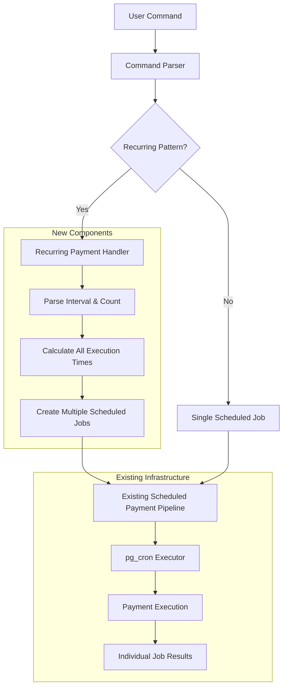
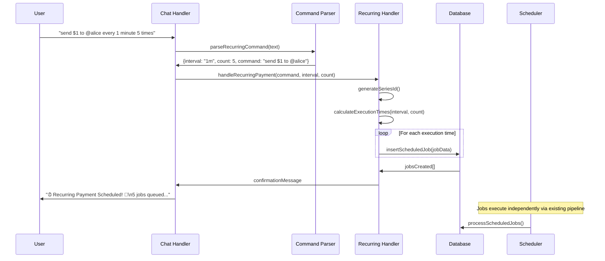
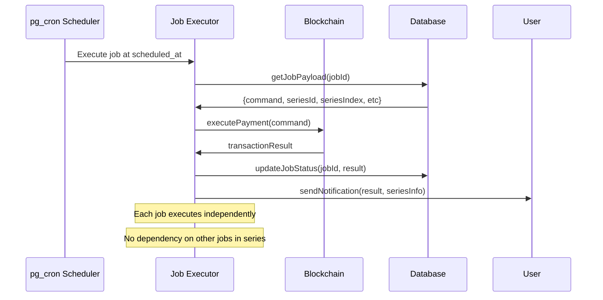

# Design Document: Recurring Payments Feature Rebuild

## Overview

This design rebuilds the broken recurring payments feature using a pre-calculation approach that leverages the existing, working scheduled payment infrastructure. Instead of complex rescheduling logic, the system treats each recurring payment as multiple independent scheduled jobs created upfront with calculated execution times.

The core philosophy: "Since our scheduled payment already works perfectly, why not treat every recurring payment as an advanced scheduled payment by simply building a calculation logic that calculates the timing of each payment as a separate scheduled payment."

## Architecture



## Sequence Diagrams

### Recurring Payment Creation Flow



### Job Execution Flow



## Components and Interfaces

### Component 1: Recurring Pattern Parser

**Purpose**: Parse user commands to detect recurring payment patterns and extract parameters

**Interface**:
```javascript
interface RecurringParser {
  parseRecurringCommand(text: string): RecurringCommand | null
  validateRecurringParams(command: RecurringCommand): ValidationResult
  convertDurationToCount(interval: string, duration: string): number
}

interface RecurringCommand {
  baseCommand: string      // "send $1 to @alice"
  interval: string         // "1m", "2h", "1d"
  count: number           // 5
  totalAmount: number     // calculated total
  isRecurring: true
}
```

**Responsibilities**:
- Parse complex recurring syntax patterns
- Convert duration formats to count formats
- Validate parameter ranges and limits
- Extract base payment command

### Component 2: Job Series Calculator

**Purpose**: Calculate all execution times and generate job data for a recurring series

**Interface**:
```javascript
interface SeriesCalculator {
  generateSeriesId(): string
  calculateExecutionTimes(startTime: Date, interval: string, count: number): Date[]
  createJobSeries(command: RecurringCommand, senderId: string): ScheduledJob[]
  validateSeriesLimits(count: number, totalDuration: number): ValidationResult
}

interface ScheduledJob {
  type: 'scheduled_p2p' | 'p2p_multi'
  scheduled_at: string
  payload: JobPayload
  status: 'pending'
  source_author_id: string
  source_author_username: string
  source_tweet_id: string
}
```

**Responsibilities**:
- Generate unique series identifiers
- Calculate precise execution timestamps
- Create job data structures
- Apply safety limits and validation

### Component 3: Series Management Handler

**Purpose**: Handle recurring payment lifecycle operations (create, cancel, status)

**Interface**:
```javascript
interface SeriesManager {
  createRecurringSeries(command: RecurringCommand, sender: Profile): Promise<SeriesResult>
  cancelSeries(seriesId: string, userId: string): Promise<CancelResult>
  getSeriesStatus(seriesId: string): Promise<SeriesStatus>
  listUserSeries(userId: string): Promise<SeriesInfo[]>
}

interface SeriesResult {
  success: boolean
  seriesId: string
  jobsCreated: number
  firstExecution: Date
  lastExecution: Date
  totalAmount: number
  message: string
}
```

**Responsibilities**:
- Orchestrate series creation process
- Handle series cancellation via status updates
- Provide series status and progress tracking
- Manage user's recurring payment history

## Data Models

### Enhanced Scheduled Job Model

```javascript
interface ScheduledJobPayload {
  // Existing fields
  platform: 'telegram' | 'discord' | 'x'
  chatId: string
  senderId: string
  senderPlatformId: string
  senderSource: 'profile' | 'wallet_profile'
  senderPayTag: string
  senderWallet: string
  command: ParsedCommand
  originalText: string
  
  // New recurring series fields
  seriesId?: string          // Links all jobs in the series
  seriesIndex?: number       // Position in series (1, 2, 3...)
  seriesTotalCount?: number  // Total jobs in series
  seriesInterval?: string    // Original interval (e.g., "1m")
  seriesFirstRun?: string    // First job execution time
  seriesLastRun?: string     // Last job execution time
}
```

**Validation Rules**:
- seriesId must be UUID format when present
- seriesIndex must be 1 ≤ index ≤ seriesTotalCount
- seriesTotalCount must be 1 ≤ count ≤ 100
- seriesInterval must match /^\d+[smhdw]$/ format

### Recurring Command Parameters

```javascript
interface RecurringParameters {
  interval: number        // Numeric value (1, 2, 30)
  unit: 's' | 'm' | 'h' | 'd' | 'w'
  count: number          // Total repetitions
  totalDuration: number  // milliseconds
  minimumInterval: 60000 // 60 seconds (pg_cron limit)
  maximumDuration: 2592000000 // 30 days
  maximumJobs: 100       // Anti-abuse limit
}
```

## Algorithmic Pseudocode

### Main Processing Algorithm

```pascal
ALGORITHM processRecurringPayment(userInput)
INPUT: userInput of type String
OUTPUT: result of type ProcessingResult

BEGIN
  ASSERT userInput is non-empty string
  
  // Step 1: Parse recurring pattern
  recurringCommand ← parseRecurringCommand(userInput)
  IF recurringCommand = null THEN
    RETURN createSingleScheduledJob(userInput)
  END IF
  
  // Step 2: Validate parameters
  validation ← validateRecurringParams(recurringCommand)
  IF NOT validation.isValid THEN
    RETURN ErrorResult(validation.message)
  END IF
  
  // Step 3: Generate series metadata
  seriesId ← generateUniqueId()
  executionTimes ← calculateExecutionTimes(
    now() + parseInterval(recurringCommand.interval),
    recurringCommand.interval,
    recurringCommand.count
  )
  
  // Step 4: Create job series atomically
  BEGIN TRANSACTION
    jobs ← []
    FOR i = 1 TO recurringCommand.count DO
      job ← createScheduledJob({
        scheduled_at: executionTimes[i-1],
        payload: {
          command: recurringCommand.baseCommand,
          seriesId: seriesId,
          seriesIndex: i,
          seriesTotalCount: recurringCommand.count
        }
      })
      jobs.add(job)
    END FOR
    
    insertResult ← database.insertJobs(jobs)
    IF insertResult.failed THEN
      ROLLBACK TRANSACTION
      RETURN ErrorResult("Failed to create job series")
    END IF
  COMMIT TRANSACTION
  
  // Step 5: Return success confirmation
  RETURN SuccessResult({
    seriesId: seriesId,
    jobsCreated: recurringCommand.count,
    firstExecution: executionTimes[0],
    lastExecution: executionTimes[recurringCommand.count-1],
    totalAmount: recurringCommand.totalAmount
  })
END
```

**Preconditions**:
- userInput is validated and non-empty
- Database connection is available
- User has sufficient permissions

**Postconditions**:
- If recurring pattern detected: multiple jobs created with same seriesId
- If single payment: one job created without series metadata
- All jobs have status='pending' and valid scheduled_at times
- Transaction is atomic (all jobs created or none)

**Loop Invariants**:
- All previously created jobs have valid seriesIndex values
- executionTimes[i] > executionTimes[i-1] for all valid i
- Total jobs created ≤ maximum allowed limit

### Series Cancellation Algorithm

```pascal
ALGORITHM cancelRecurringSeries(seriesId, userId)
INPUT: seriesId of type String, userId of type String
OUTPUT: result of type CancelResult

BEGIN
  ASSERT seriesId matches UUID format
  ASSERT userId is valid user identifier
  
  // Step 1: Find pending jobs in series
  pendingJobs ← database.query(
    "SELECT id FROM scheduled_jobs 
     WHERE payload->>'seriesId' = ? 
     AND status = 'pending' 
     AND payload->>'senderPlatformId' = ?",
    [seriesId, userId]
  )
  
  IF pendingJobs.length = 0 THEN
    RETURN CancelResult(false, "No pending jobs found or not authorized")
  END IF
  
  // Step 2: Update all pending jobs to failed status
  BEGIN TRANSACTION
    updateResult ← database.update(
      "UPDATE scheduled_jobs 
       SET status = 'failed', 
           error_message = 'Cancelled by user' 
       WHERE id = ANY(?)",
      [pendingJobs.map(j => j.id)]
    )
    
    IF updateResult.failed THEN
      ROLLBACK TRANSACTION
      RETURN CancelResult(false, "Failed to cancel series")
    END IF
  COMMIT TRANSACTION
  
  RETURN CancelResult(true, 
    "Cancelled " + pendingJobs.length + " pending payments")
END
```

**Preconditions**:
- seriesId is valid UUID format
- userId has authorization to cancel the series
- Database is accessible

**Postconditions**:
- All pending jobs with matching seriesId are marked as 'failed'
- Already executed jobs remain unchanged
- Operation is atomic (all updates succeed or none)

## Key Functions with Formal Specifications

### Function 1: calculateExecutionTimes()

```javascript
function calculateExecutionTimes(startTime, interval, count)
```

**Preconditions**:
- `startTime` is valid Date object in future
- `interval` matches format /^\d+[smhdw]$/
- `count` is positive integer ≤ 100

**Postconditions**:
- Returns array of exactly `count` Date objects
- Each date is ≥ 60 seconds from previous (pg_cron minimum)
- First date equals `startTime`
- Last date - first date ≤ 30 days
- All dates are in chronological order

**Loop Invariants**:
- result[i] > result[i-1] for all valid i
- result[i] - result[0] = i * intervalMs

### Function 2: generateSeriesId()

```javascript
function generateSeriesId()
```

**Preconditions**: None (pure function)

**Postconditions**:
- Returns string in UUID v4 format
- Guaranteed unique across all series
- 36 characters including hyphens
- Matches pattern /^[0-9a-f]{8}-[0-9a-f]{4}-4[0-9a-f]{3}-[89ab][0-9a-f]{3}-[0-9a-f]{12}$/

### Function 3: validateRecurringParams()

```javascript
function validateRecurringParams(command)
```

**Preconditions**:
- `command` is RecurringCommand object
- `command.interval` and `command.count` are defined

**Postconditions**:
- Returns ValidationResult with isValid boolean
- If invalid: includes descriptive error message
- Checks: interval ≥ 60s, count ≤ 100, totalDuration ≤ 30d
- Verifies total amount is reasonable (≤ $10,000 per job)

## Example Usage

```javascript
// Example 1: Basic recurring payment
const command = "send $1 to @alice every 1 minute 5 times"
const result = await processRecurringPayment(command, senderId)

// Creates 5 jobs:
// Job 1: scheduled_at = now + 1m, seriesIndex = 1
// Job 2: scheduled_at = now + 2m, seriesIndex = 2  
// Job 3: scheduled_at = now + 3m, seriesIndex = 3
// Job 4: scheduled_at = now + 4m, seriesIndex = 4
// Job 5: scheduled_at = now + 5m, seriesIndex = 5

// Example 2: Duration-based recurring payment
const command2 = "send $2 to @bob every hour for 3 hours"
const result2 = await processRecurringPayment(command2, senderId)
// Automatically calculates: 3 jobs, every 1 hour

// Example 3: Series cancellation
const cancelResult = await cancelSeries(seriesId, userId)
// Updates all pending jobs to status='failed'
```

## Correctness Properties

*A property is a characteristic or behavior that should hold true across all valid executions of a system-essentially, a formal statement about what the system should do. Properties serve as the bridge between human-readable specifications and machine-verifiable correctness guarantees.*

### Property 1: Command Parsing Consistency

*For any* valid recurring payment command, parsing then reformatting the extracted components should produce an equivalent command structure.

**Validates: Requirements 1.1, 1.2, 1.3, 1.4**

### Property 2: Series Job Count Preservation

*For any* valid recurring payment request with count N, the Series_Calculator should create exactly N scheduled jobs with consecutive series indices from 1 to N.

**Validates: Requirements 2.3, 2.4**

### Property 3: Time Calculation Monotonicity

*For any* series of scheduled jobs with the same interval, the execution times should be monotonically increasing with each job scheduled exactly one interval after the previous job.

**Validates: Requirements 6.1, 6.3**

### Property 4: Series Atomicity

*For any* recurring payment creation request, either all jobs in the series are successfully created in the database, or no jobs are created at all.

**Validates: Requirements 2.5, 8.1**

### Property 5: Job Execution Independence

*For any* job in a recurring series, its execution success or failure should not affect the processing of other jobs in the same series.

**Validates: Requirements 5.1, 5.2, 5.3**

### Property 6: Validation Boundary Enforcement

*For any* recurring payment parameters, the system should reject requests that violate minimum interval (60 seconds), maximum job count (100), or maximum duration (30 days) limits.

**Validates: Requirements 3.1, 3.2, 3.3**

### Property 7: Authorization Verification

*For any* series cancellation request, only the original creator of the series should be able to successfully cancel pending jobs in that series.

**Validates: Requirements 4.1, 4.3, 4.5**

### Property 8: Series Metadata Consistency

*For any* group of jobs with the same series ID, all jobs should have identical series metadata (total count, interval, creation details) and unique sequential indices.

**Validates: Requirements 2.4, 5.4**

### Property 9: Status Update Isolation

*For any* job status update operation, only the targeted job's status should change while all other jobs in the series remain unaffected.

**Validates: Requirements 4.2, 5.5**

## Error Handling

### Error Scenario 1: Invalid Recurring Syntax

**Condition**: User provides malformed recurring pattern
**Response**: Parse as single scheduled payment or return syntax error
**Recovery**: Provide example of correct syntax

### Error Scenario 2: Excessive Job Count

**Condition**: Calculated job count > 100 or duration > 30 days
**Response**: Reject with clear limits explanation
**Recovery**: Suggest reduced frequency or count

### Error Scenario 3: Database Transaction Failure

**Condition**: Partial job creation due to database error
**Response**: Rollback all jobs, return error message
**Recovery**: User can retry command after checking system status

### Error Scenario 4: Insufficient Balance

**Condition**: User balance < total recurring amount
**Response**: Show balance warning, allow to proceed with risk notice
**Recovery**: User can top up balance before first execution

## Testing Strategy

### Unit Testing Approach

**Core Components**:
- Pattern parsing with 50+ test cases covering all syntax variants
- Time calculation verification with edge cases (leap years, DST, timezone boundaries)
- Series ID generation uniqueness testing
- Parameter validation boundary testing

**Test Coverage Goals**: >95% line coverage for all new components

### Property-Based Testing Approach

**Property Test Library**: fast-check (JavaScript property-based testing)

**Key Properties**:
1. **Parsing Idempotency**: `parseCommand(command).baseCommand` extracts valid payment
2. **Time Monotonicity**: Generated execution times are always in ascending order
3. **Count Preservation**: Number of jobs created equals requested count
4. **Series Integrity**: All jobs in series have consistent metadata

**Property Test Examples**:
```javascript
// Property 1: Time calculation correctness
fc.property(fc.integer(1, 100), fc.integer(60, 86400), (count, intervalSecs) => {
  const times = calculateExecutionTimes(new Date(), `${intervalSecs}s`, count)
  return times.length === count && 
         times.every((t, i) => i === 0 || t > times[i-1])
})

// Property 2: Series metadata consistency  
fc.property(fc.integer(1, 50), (count) => {
  const jobs = createJobSeries(mockCommand, count)
  const seriesIds = [...new Set(jobs.map(j => j.payload.seriesId))]
  return seriesIds.length === 1 && 
         jobs.every(j => j.payload.seriesTotalCount === count)
})
```

### Integration Testing Approach

**Database Integration**:
- Test atomic job creation with transaction rollbacks
- Verify series cancellation updates all related jobs
- Test concurrent series creation (race condition handling)

**End-to-End Flows**:
- Complete user command → job creation → execution pipeline
- Error scenarios with realistic failure conditions
- Performance testing with large job series

## Performance Considerations

**Job Creation Efficiency**:
- Batch insert all jobs in single transaction (vs. individual inserts)
- Pre-calculate all timestamps to minimize database computation
- Use prepared statements for job insertion

**Query Optimization**:
- Index on `payload->>'seriesId'` for fast series queries
- Index on `scheduled_at` for executor job fetching
- Consider partitioning scheduled_jobs table by time ranges

**Memory Usage**:
- Stream large job series creation rather than loading all in memory
- Limit concurrent series creation to prevent memory spikes

## Security Considerations

**Abuse Prevention**:
- Hard limit of 100 jobs per series prevents resource exhaustion
- Rate limiting on recurring command creation (separate from regular commands)
- Total amount validation to prevent economic abuse

**Authorization**:
- Series cancellation requires original creator verification
- Platform-specific user ID validation for cross-platform security
- Prevent series ID enumeration attacks with UUID format

**Data Integrity**:
- Series metadata validation before job creation
- Atomic transactions prevent partial series creation
- Input sanitization for all user-provided parameters

## Dependencies

**Existing Systems**:
- `scheduled_jobs` table with existing schema
- pg_cron scheduler for job execution
- Existing payment execution pipeline
- Current command parsing infrastructure

**New Dependencies**: None - leverages existing infrastructure

**Database Schema Changes**:
```sql
-- No schema changes required
-- Uses existing payload jsonb column for series metadata
-- Existing indexes support new query patterns
```

## Migration Strategy

**Backward Compatibility**:
- Existing scheduled payments continue working unchanged
- New recurring payments use same execution pipeline
- No breaking changes to current API

**Rollout Plan**:
1. Deploy recurring parser alongside existing code
2. Test with limited user group
3. Gradual rollout with monitoring
4. Full deployment after validation

**Rollback Plan**:
- Feature flag to disable recurring parsing
- Existing single scheduled payments unaffected
- Cancel any pending recurring jobs if needed